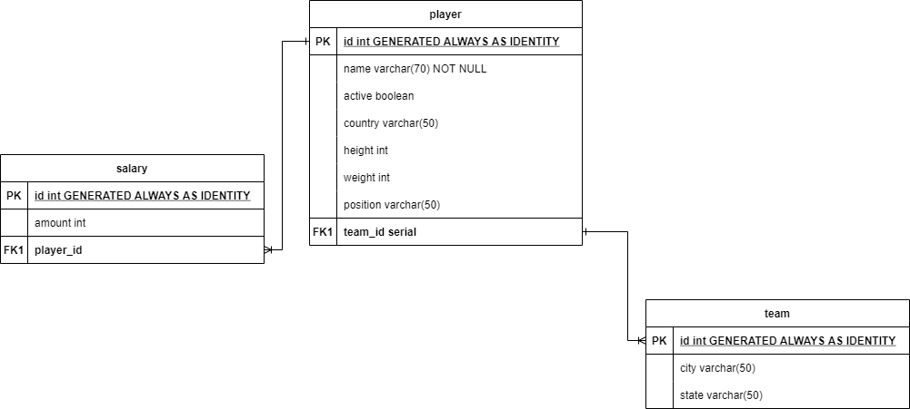

# Exercicio 1
Em anexo há um arquivo com diversas informações de jogadores.
Cada linha contém a informação de salário do jogador em uma determinada temporada, então é possivel que existam várias linhas para o mesmo jogador.
Você deverá modelar um banco de dados de forma que essas informações sejam guardadas de forma mais concisa. Ex: Faz sentido eu ter uma tabela com os salários dos jogadores e uma tabela com as informações do jogador em si? Faz sentido criar uma tabela com todos os times?
Após fazer a modelagem do banco, você deverá popular ele com as informações.

Após popular as tabelas você deverá responder as seguintes perguntas:
1. Qual posição mais paga por estado?
2. Média, mínimo e máximo salário por altura?


## ERD


<br />

O diagrama foi desenvolvido em: https://app.diagrams.net/
A ideia foi subdividir a tabela raw em três usando como modelo o "Star Schema". Inicialmente a ideia de desmembrar em três tabelas levou em consideração a possibilidade de transformar a categoria "salary" em uma entidade própria, que contesse seus próprios atributos. Mas, após reflexão, percebi que seria melhor manter "player" e "salary" em uma tabela apenas, exceto se houvesse alguma outra coluna relacionada que justificasse converter "salary" em entidade.

## Criação da tabela raw

``` sql
CREATE TABLE raw(
 	ROW serial PRIMARY KEY,
 	ID integer,
 	ACTIVE boolean,
 	NAME varchar(70),
 	COUNTRY varchar(30),
 	HEIGHT integer,
 	WEIGHT integer,
 	POSITION varchar(20),
 	TEAM_ID integer,
 	TEAM_CITY varchar(20),
 	TEAM_STATE varchar(20),
 	PLAYER_SALARY_AMOUNT integer
);
```
Foram desconsideradas as seguintes colunas: player_salary_season, por causa do conflito entre o script DAPI Python de preenchimento da tabela raw e a categoria timestamp (ele não reconhecia o formato de timestamp na referida coluna).

## Execução do DAPI Script Python

```python
import psycopg2

conn = psycopg2.connect(dbname="exercicio1", user="elissa_kumulus", password="123")
cur = conn.cursor()
with open('C://Users/elissa.gabriela/Documents/TrilhaDados/SQLFundamentals/Exercicio1/PlayerWithSalarySeason-210902-184055_commasep.csv', 'r') as csv_file:
    next(csv_file)
    cur.copy_from(csv_file, 'raw', sep=',')
conn.commit()
conn.close()
```
Para popular a tabela raw desenvolvi um pequeno script em Python que se conecta com o banco de dados local que eu criei no PostgreSQL.

## Criação das tabelas do schema

```sql
CREATE TABLE player (
    id INT
        GENERATED ALWAYS AS IDENTITY
        (START WITH 1 INCREMENT BY 1),
    team_id SERIAL,
    name VARCHAR(70) NOT NULL,
    active BOOLEAN,
    country VARCHAR(50),
    height INT,
    weight INT,
    position VARCHAR(50),

    PRIMARY KEY(id)
);

CREATE TABLE salary (
    id INT
        GENERATED ALWAYS AS IDENTITY
        (START WITH 1 INCREMENT BY 1),
    player_id SERIAL,
    amount INT,

    PRIMARY KEY(id)
);

CREATE TABLE team(
    id INT
        GENERATED ALWAYS AS IDENTITY
        (START WITH 1 INCREMENT BY 1),
    city VARCHAR(50),
    state VARCHAR(50),
    team INT,

    PRIMARY KEY(id)
);
```

Todas as Primary Keys foram criadas como "identity" visto que o PostgreSQL não aceita o tipo UNIQUE e nem o "serial" como definidores da unicidade de uma linha.

## Inserção dos dados da tabela raw nas tabelas do schema

```sql
INSERT INTO team (city, state, team)
SELECT team_city, team_state, team_id
FROM raw;

INSERT INTO player (name, active, country, height, weight, position)
SELECT name, active, country, height, weight, position 
FROM raw;

INSERT INTO salary (amount)
SELECT player_salary_amount
FROM raw;
```

## Criação das relações PK-FK

```sql
ALTER TABLE player
ADD CONSTRAINT fk_player_team
FOREIGN KEY (team_id)
REFERENCES team(id);

ALTER TABLE salary
ADD CONSTRAINT fk_salary_player
FOREIGN KEY (player_id)
REFERENCES player(id);
```

## Teste das tabelas

```sql
SELECT * FROM salary LIMIT 10;
SELECT * FROM player LIMIT 10;
SELECT * FROM team LIMIT 10;
```
<br />

---

<br />

## **RESPOSTAS**

### **Questão 1**

Qual posição mais paga por estado?
```sql
SELECT t3.estado, t3.posicao, t3.salario_total
-- Agrupamento por estado
FROM(SELECT estado, MAX(salario_total) max_salario_total
    FROM(SELECT t.state estado, p.position posicao, SUM(s.amount) salario_total
            FROM player p
            JOIN salary s
            ON p.id = s.player_id
            JOIN team t
            ON p.team_id = t.id
            GROUP BY 1, 2) t1
    GROUP BY 1) t2
-- Agrupamento por posição
JOIN(SELECT t.state estado, p.position posicao, SUM(s.amount) salario_total
    FROM player p
    JOIN salary s
    ON p.id = s.player_id
    JOIN team t
    ON p.team_id = t.id
    GROUP BY 1, 2
    ORDER BY 3 DESC) t3
ON t3.estado = t2.estado AND t3.salario_total = t2.max_salario_total
ORDER BY 1;
```

### **Questão 2**
Média, mínimo e máximo salário por altura?
```sql
SELECT p.height altura, 
    ROUND(AVG(s.amount)) media,
    MIN(s.amount) minimo,
    MAX(s.amount) maximo  
FROM player p
JOIN salary s
ON p.id = s.player_id
GROUP BY 1
ORDER BY 1;
```
